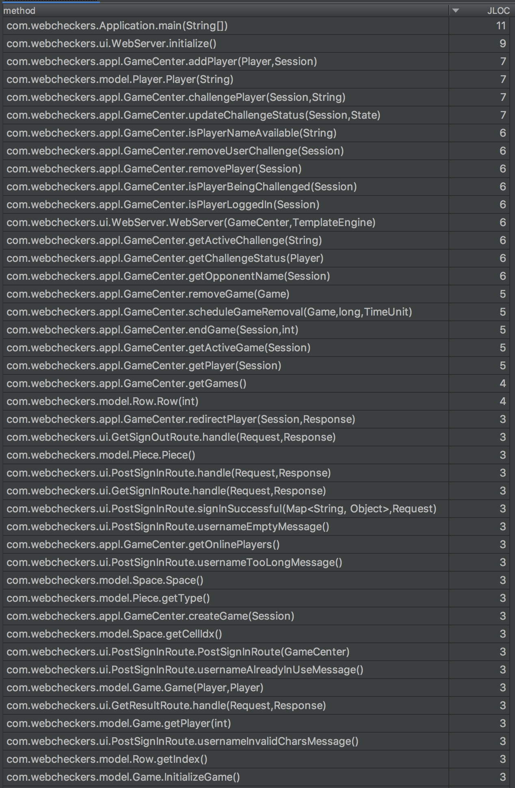

# WebCheckers Game Design Documentation

## Team Information
* Team name: 
    * Spades - 01
* Team Members:
    * Moayad Alshangiti
    * José Reyes Arias
    * Murtaza Tamjeed
    * Harsha Vardhn Muppuri
    * Arpita Kale

## Executive Summary

WebCheckers is a web applicaton developed for users to play game of checkers. The game user interface supports drag-and-drop browser capabilities for making moves. Players are not required to create permanent accounts, they can sign in with a username. However, if a user name is already occupied, player has to sign in with a different username. 

### Purpose
WebCheckers aims to allow users to play game of checkers with other players who are currently signed in. We believe the project requirements set by the product owner’s vision document and the individual goals of the users stories acceptance criteria have been fulfilled. Beyond the basic game winning conditions of a player resigning or capturing all opponent pieces, we check for a tie (when 70 non-capture moves are performed) and we check for a blockage (board still contains player pieces, but the player cannot make any move).

### Glossary and Acronyms

| Term | Definition |
|------|------------|
| Checkers | Board game for two players, which involve diagonal moves of pieces and mandatory captures by jumping over opponent pieces |
| Challenger | player initiating the challenge
| Opponent | Challenged player |
| Move | Diagonal movement of pieces on board |
| Capture | Remove opponent’s pieces |

## Requirements

### Definition of MVP
The Minimum Viable Product (MVP) for the WebCheckers application is that a user be able to play game of checkers with another user that is currently logged in to the application. In order to do so, each player has to login and choose a name to play with. After logged in, the user may challenge another user that is currently logged in to play a game of checkers against, using the American checkers rule. During the game, either player can choose to resign which end the game. 

### Features
TThis section describes the implemented features of the game (updated for Sprint 4):
 * A player must sign-in before playing a game.
 * The selected player username must adhere to the following rules:
    * Must not be already in-use by another online player.
    * Must not be empty.
    * Must not be longer than 30 chars.
    * Must contain only alphanumeric characters (no space or special chars allowed).
 * A player can sign-out at any given time.
 * Lobby/Matchmaking
    * A player can pick an opponent from a list of online players.
    * The list of online players will only show free players, i.e., not in a game nor in an active challenge request.
    * The Challenger can withdraw his challenge request at any point of time. This is used an exit strategy if the opponent was not responsive to the request.
    * The Opponent can accept or decline a request. 
    * Once a challenge is initiated both players are removed from the list of online players until a challenge decision is reached.
    * Once Opponent accepts a challenge, the game begins.
    * The challenge object is cleaned from memory once the game starts.
* Gameplay:
    * The game user interface supports drag-and-drop browser capabilities for making moves.
    * Players take turn playing, but the player with the White pieces always has the first move.
    * A player can move a single piece forward and diagonally only as per the game rules.
    * A player can move a crowned piece diagonally but in all four directions as per the game rules.
    * A piece is crowned once it reaches the end of the board.
    * A player can make multiple captures if possible.
    * A player can backup a single move if needed.
* Game-ending:
    * Winning condition 1 (Forfeit game): Game ends if one of the players resigned/quit.
    * Winning condition 2 (Standard winning): Game ends if one of the players captured all the opponent pieces.
    * Winning condition 3 (Tie): Game ends in a tie if 70 non-capture moves were made.
    * Winning condition 4 (Blockage winning): Game ends if one of the players movement is completely blocked (Still has pieces, but cannot make a move).
    * Once a game concludes, both players are redirected to the result page, and then to lobby.
    * Once a game concludes, a scheduler is started to clean the game object from memory after 10 minutes. The scheduler is used to allow players enough time to see the result as this information is encapsulated within the game object. Also, using a scheduler ensures that the game object will be removed even if one or both players decided to close the browser without viewing the result.

## Application Domain

Basic checkers game is designed to play using American rules. Diagram 1 represents the
application domain of the model. User can play against an opponent after signing In. With
valid username, user is navigated to select a player page to challenge an opponent and
start the game. Each player has a turn which is validated before every move and is
switched between the players.

### Details of each Domain Area
The figure below shows the domain model for the application. Our domain model consists of the following elements.

* **Player:** A player interacts with a Game to move pieces. A player has up to 12 pieces. They, are allowed move pieces diagonally. The number of moves depend on type of piece a player is moving.  
* **Checkers Game:** A checkers game has two players. 
* **Board:** A board has 64 spaces on it in 8x8 layout.
* **Spaces:** A space contains a piece.
* **Pieces:** A piece could be red or white and could be a single piece or king piece. 

### Domain Model

## Architecture

### Summary
Below diagram shows a high level view of application architecture:

As a web application user interacts with the web application. The User Interface is
composed of HTML pages, CSS for styling of the page and javascript on the client
side.The server side UI contains controllers and views. controllers are built using spark
framework, and views are built using Freemarker framework.

### Overview of User Interface Tier
Game UI includes routes to different pages so that corresponding view templates are
generated.
Current game implementation includes Webserver, GetSignInRoute, GetSignOutRoute,
HomeController, PostSignInRoute and SignInController.

* Webserver:
This route initializes all the HTTP routes and each route can be called with respective
URLs.
* GetSignInRoute :
This route provides sign-in page for the user. 
* PostSignInRoute :
This route is used to validate a selected username and signs in the player if conditions are met.
* GetSignOutRoute :
The route is used to sign-out an online player.
* HomeController :
This route is basic controller of home page. Routes to sign in page if user is not signed in
and to game page if already sign in.
* PostHomeController : This route is used to process the matchmaking logic, e.g., challenging a player.
* GameRoute: This route is used to show the current game state.
* PostBackupMoveRoute: The route is used to allow the user to backup a single move.
* PostCheckTurnRoute: This route is used to check if the opponent has made his/her move.
* SubmitRoute: This route is used to submit the current player's turn.
* ValidateRoute: This route is used to validate the current player's move.
* PostResignRoute: This route is used to resign a player out of the game (forfeit match).
* GetResultRoute: This route is used to show the result of a concluded match.

**One key aspect** of our UI tier is that we have tried to implement a good routing strategy in that we validate the user state at the beginning of each route. If the user was trying to access the wrong route, e.g.,  manually typing '/game' when the player has no active game, then he will be redirected to the correct route.
### Overview of Application Tier
This application tier has two main classes:
* GameCenter: This class acts as a central piece to the game. I is capable of adding user to the game,verify if
the user is already logged in or not, and removing the user from the game when signed out. Moreover, it manages the matchmaking logic and keeps track of challenges. Finally, it keep track of active game and it can start/end a game.
* GameCleaner: This class is used by the scheduler to remove the game object from memory after X number of minutes.

### Overview of Model Tier
The model tier contains all the main components of the application. The following classes are part of this tier:
* Board: The class represents a Checkers board.
* Challenge: This class holds a challenge information.
* Game: This class represents a Checkers game.
* Message: This class represents a game message (sent to the user).
* Move: This class represents a checkers piece move (from/to).
* Piece: This class represents a checkers piece.
* Player: This class represents an online player.
* Position: This class represents a specific location on the board (row/cell).
* Row: This class represents a board row.
* Space: This class represents a board space/cell.

This tier also holds a couple of enum classes:
* User.State: IN_HOME, IN_GAME, IN_RESULT.
* Challenge.State: NO_CHALLENGES, CHALLENGE_PENDING, CHALLENGE_ACCEPTED, CHALLENGE_DECLINED, CHALLENGE_CANCELLED.
* GameState: IDLE, PENDING, SKIP, OVER.
* MessageType: INFO, ERROR.
* PieceColor: RED, WHITE.
* Crown: SINGLE, KING.

## Class Diagrams:
First, the UI tier:

Second, the model tier:

Finally, the application tier: 

## State Diagram:

## Sequence Diagram:

## Metric Analysis
We conducted a comprehensive code metrics analysis as part of Sprint 4 metric analysis. An analysis of the metrics measured for the project are shown in the following figures.

### MartinPackage Metrics
The Martin Package metrics offer a high-level overview of the packages. 

We observe a couple of high value scores which may indicate a code smell. However, once analyzed, we believe non of the smells represent an issue. For example, we observed the following:
* The **model package** is a key package in our application. We should be very careful about making any changes to this package as it can affect the classes in other packages. This is observed by the high Affarent coupling score (35) and the low instability score (0.2) as those two indicate that the class within other packages rely heavily on the classes within this package. This makes a lot of sense as the model package contains all the main component of the Checkers game.
* The **UI package** contains classes that are heavily coupled with classes in other packages. Also, this package is highly sensitive to any changes in the other packages. This makes a lot of sense as well since the UI package contain classes that act as a middle man between the backend application logic and the frontend application logic. Thus, it communicates heavily with classes from all different packages.

### Chidamber-Kemerer Metrics
The Chidamber-Kemerer Metrics provide a class-level analysis to guide us to potential class that could benefit from code refactoring.

In this figure, we listed all the classes and their corresponding metrics. We observed the following:
* The GameCenter class suffers from a high coupling score (CBO) of 32, a high RFC of 56, and a high WMC of 59. This makes sense once we analyze the role of GameCenter. The class handles: 1) user sign-in and sign-out, 2) list of online users, 3) matchmaking logic, 4) list of all active challenges, 5) game creation and game ending logic, 6) list of all active games. Thus, it makes sense that it would show such a high complexity and coupling. Once possible solution is to refactor this class into two separate class. The first, e.g., PlayerLobby, handles the logic of the first 4 points, i.e., user login/logout and matchmaking logic responsibilities, whereas, the second GameCenter, would handle only the last two responsibility, i.e., game related responsibilities.
* The Game class also suffers from a similar issue but at a smaller scale. One possible solution to this is to take some of the game logic encapsulated within the Game class and transfer that to the GameRules and Board Classes.
### Complexity Metrics
The complexity metric provide a method level analysis that we can utilize to identify areas that could benefit from potential refactoring.

In the figure, we listed the methods with above normal complexity. We specifically observed two methods with quite high values "checkMoveAvailable()" and "checkSimplyCapturingMovement()". When we analyzed the two methods we noticed that they contain two large for loops with multiple if-statements which indeed shows code complexity. Thus, refactoring those two methods by breaking it into four methods is one of the refactoring recommendations we have for our future work. 

### Code Test Coverage
We have reached an overall 90% testing coverage. We are happy with our progress and we believe the tests cover all the key aspects of the game.

### Javadoc Coverage
We believe we have a good level of documentation with the game. However, there's always room for improvement. The Javadoc coverage metric revealed to us that we have short comments as many methods with 'three-lines-comments' are seen. Such comments might mot be useful in some cases as the method name may reveal the same information as the comment. For future work, we could improve the quality of our comments by adding more information.

### Line Of Code Metrics
The insight provided by the lines of code metric is quite limited. The only conclusion we can draw from it is that the UI tier represents the biggest bulk of code, which means it would be the most challenging to maintain and test.

