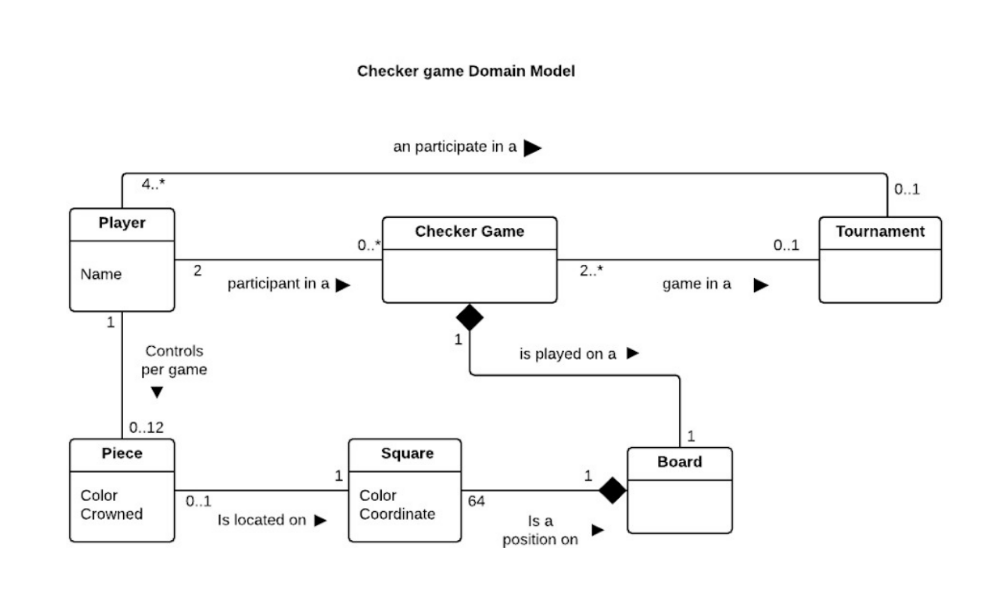
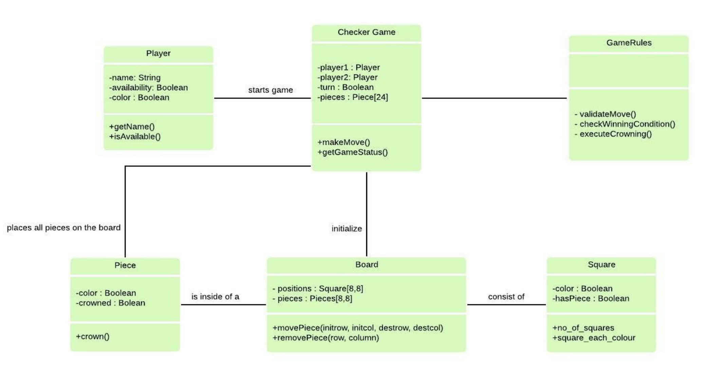
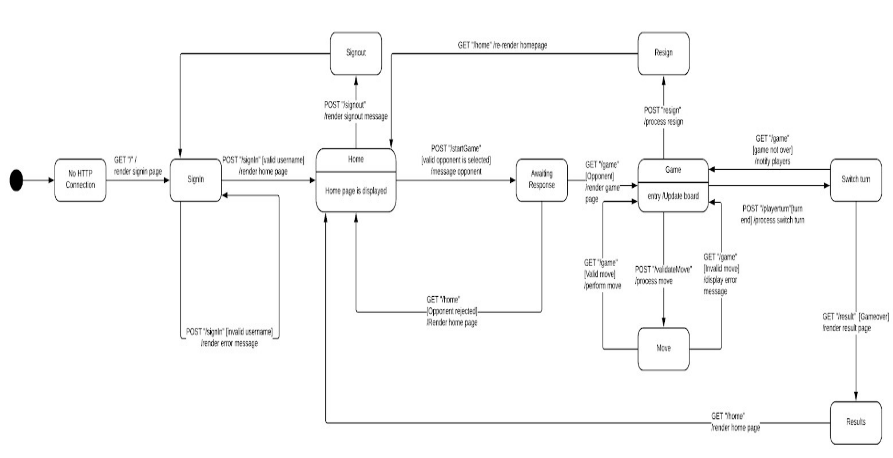
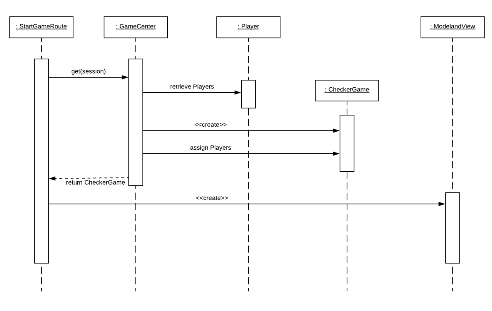

# WebCheckers Game Design Documentation
## Executive Summary

WebCheckers is a web applicaton developed for users to play game of checkers. The game user interface supports drag-and-drop browser capabilities for making moves.

### Purpose
WebCheckers aims to allow users to play game of checkers with other players who are currently signed in. 

### Glossary and Acronyms

| Term | Definition |
|------|------------|
| Checkers | Board game for two players, which involve diagonal moves of pieces and mandatory captures by jumping over opponent pieces |
| Opponent | Challenged player |
| Move | Diagonal movement of pieces on board |
| Capture | Remove opponent’s pieces |

## Requirements

WebCheckers applicaton inclues following important features:
* Every player must sign-in before playing a game.
* Two players must be able to play a game of checkers based upon the American rules.
* Player sign in
* Challenge a player
* Accept a challenge
* Move peice
* Capture opponent peice
* Forfeit game
* Sign out of the game

### Definition of MVP
In order for the game to satisfy players, it has enough features. For example, it allows users to sign in, play a game with other player and choose to resign the game.  

### MVP Features
The minimal features of the applicataon to satisfy players include following features:
* Every player must sign-in before playing a game.
* Two players must be able to play a game of checkers based upon the American rules.
* Either player of a game may choose to resign, which ends the game.
 
### Roadmap of Enhancements
Beyond the minimum features mentioned above, following are possible ehancement features to the system:
* Games can be stored for later review.
* Players can play asynchronously.
* A player may play more than one game at a time.
* Other players may view an on-going game that they are not playing.
* Players may play a game against an AI player.
* Players can play in checkers tournaments.

## Application Domain

Basic checkers game is designed to play using American rules. Diagram 1 represents the
application domain of the model. User can play against an opponent after signing In. With
valid username, user is navigated to select a player page to challenge an opponent and
start the game. Each player has a turn which is validated before every move and is
switched between the players.

### Domain Model

## Architecture

### Summary
Below diagram shows a high level view of application architecture:

As a web application user interacts with the web application. The User Interface is
composed of HTML pages, CSS for styling of the page and javascript on the client
side.The server side UI contains controllers and views. controllers are built using spark
framework, and views are built using Freemarker framework.

### Overview of User Interface
Game UI includes routes to different pages so that corresponding view templates are
generated.
Current game implementation includes Webserver, GetSignInRoute, GetSignOutRoute,
HomeController, PostSignInRoute and SignInController.

* Webserver:
This route initializes all the HTTP routes and each route can be called with respective
URLs.
* GetSignInRoute :
This route provides sign In page for the user. It allows the to enter the user name and it is
a mandatory step for the user to play the game.
* GetSignOutRoute :
This re-routes the user to home page,when user clicks on sign out button. No page is
generated instead user is navigated back to the homepage.
* HomeController :
This route is basic controller of home page. Routes to sign in page if user is not signed in
and to game page if already sign in.
* PostSignInRoute :
This route accepts username input from user. This name used to create instance,verify
username and allow user to play the game.
* SignInController :
This route provide the sign in page for the user and user can enter the username to login.

### Overview of Application Tier
This model tier has Game Center class that is capable of adding user to the game,verify if
the user is already logged in and removing the user from the game when signed out. This
information is stored and passed on to the UI tier classes.

### Overview of Model Tier
This tier has the class Player that is needed to play the checkers game.
Player :
This class represents a player playing a game. It creates a new player with the user name
selected by the player and also validates if the username according the constraints
mentioned in the story.

## Class Diagram:

## State Diagram:

## Sequence Diagram:

